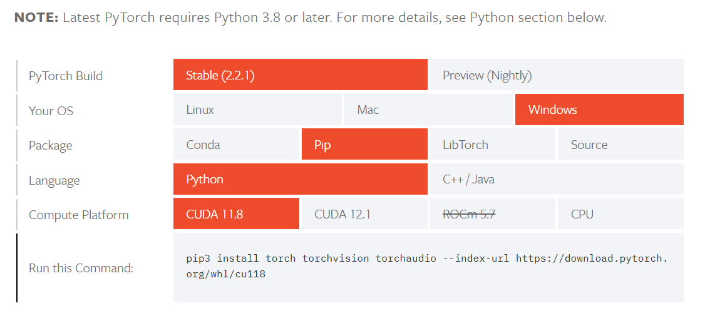

# Let's Build and Learn Pinecone (and CLIP too)

This project is an exploration into multimodal semantic search, and we will build a meme search-engine. The goal will be to input text queries, and find the most semantically related memes in our dataset. 

The dataset used in this project is a subset of the [ImgFlip575K Memes Dataset.](https://github.com/schesa/ImgFlip575K_Dataset)

## What is Pinecone?
Pinecone's tagline is "Longterm memory for AI". Simply put, it is a vector database. What's that? This is how Roie from Pinecone explains : "Vector databases are purpose-built databases that are specialized to tackle the problems that arise when managing vector embeddings in production scenarios. For that reason, they offer significant advantages over traditional scalar-based databases and standalone vector indexes." Read this [excellent blog](https://www.pinecone.io/learn/vector-database/) by Roie for a deep dive.
Vector databases like Pinecone have multiple usecases like semantic search, generative question answering, generative chatbot agents, and [many more.](https://www.pinecone.io/learn/category/use-cases/)

### Getting started with Pinecone

To get started with Pinecone, first create a free tier account (Pod based index) to get an api key, and then install the Pinecone client using pip:

```bash
pip3 install pinecone-client
```

### Creating a Pod-based Index
An [index](
  https://docs.pinecone.io/guides/indexes/understanding-indexes
) is the highest-level organizational unit of vector data in Pinecone. It accepts and stores vectors, serves queries over the vectors it contains, and does other vector operations over its contents. Two types of indices are currently offered - serverless and pod-based.

The "Starter plan" offers one free pod-based [starter index](https://docs.pinecone.io/guides/indexes/create-an-index#create-a-starter-index), capable of supporting up to 100,000 vectors. You can create your index as follows:

```python
from pinecone import Pinecone, PodSpec

pc = Pinecone(api_key="YOUR_API_KEY")

pc.create_index(
  name="starter-index",
  dimension=1536,
  metric="cosine",
  spec=PodSpec(
    environment="gcp-starter"
  )
)
```
Ensure to replace "YOUR_API_KEY" with your actual Pinecone API key.

To list all the existing indexes :
```python
# list indices
print(pc.list_indexes().names())
```


## What is CLIP?
CLIP (Contrastive Language–Image Pre-training) is an OpenAI model designed to understand and generate representations for both images and text within the same embedding space. This allows for performing tasks like semantic search where the inputs can be in different modalities.

### NVIDIA GPU and CUDA
CUDA® is a parallel computing platform and programming model developed by NVIDIA for general computing on graphical processing units (GPUs). So generally all NVIDIA graphics cards currently support CUDA because it is proprietary. But for the curious, check if your GPU is in this [list.](https://developer.nvidia.com/cuda-gpus) 

To leverage GPU acceleration with PyTorch and CLIP we will make use of CUDA. To check your local CUDA version:

```bash
nvcc --version
```

Expected output format:
```bash
...
Cuda compilation tools, release XX.X, VXX.X.XX
...
```


### Installing PyTorch
PyTorch provides a [helpful tool](https://pytorch.org/get-started/locally/) for selecting the appropriate installation command based on your system configuration :



Install PyTorch. 
```bash
pip3 install torch torchvision torchaudio --index-url https://download.pytorch.org/whl/cu118
```

My local CUDA version is 11.2, and as this was not available in the Pytorch tool, I was confused, but according to this [forum discussion], PyTorch doesn't use the locally installed CUDA toolkit but instead ships with its own CUDA Runtime dependencies, and my GTX-1650 is supported in all currently release Pytorch binaries.


### Installing CLIP
Once PyTorch is set up, install CLIP directly from its GitHub repository:

```bash
pip install git+https://github.com/openai/CLIP.git
```
For more detailed information on CLIP, visit the [official GitHub repository.](https://github.com/openai/CLIP)
